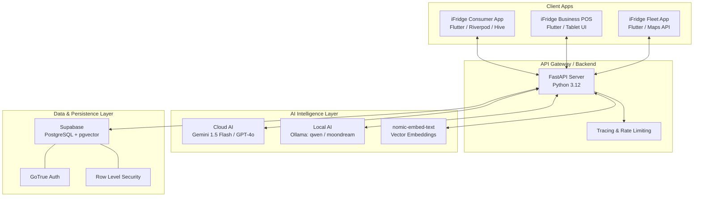
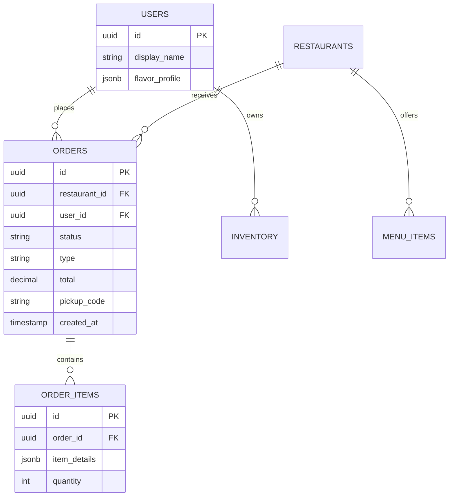
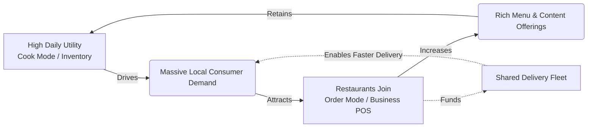

# 🧊 iFridge: The Master Blueprint & Vision Document

> **Mission Statement:** To eliminate food waste, democratize smart cooking, and revolutionize local food commerce through a unified, AI-driven, three-sided marketplace ecosystem.

---

## 1. Executive Summary & Core Philosophy

The modern food landscape is broken and highly fragmented. Consumers bounce between disjointed applications: one for tracking groceries, a browser for searching recipes, and exorbitant third-party apps for ordering delivery. Meanwhile, restaurants are trapped by these very same delivery platforms, surrendering 30%+ in commission margins just to reach their customers, while juggling multiple closed-ecosystem Point-of-Sale (POS) tablets.

**iFridge is the unified solution.** 

We are building a comprehensive **Three-Sided Food Commerce Ecosystem**. By providing users with a world-class, AI-powered smart kitchen assistant (The Demand Engine), we naturally capture their daily food decision-making process. We then funnel this highly engaged user base directly into a localized, low-commission commerce platform serving local restaurants (The Supply Engine), supported by an independent, shared delivery network (The Logistics Engine).

---

## 2. The Three Pillars of the Ecosystem

### Pillar I: The Consumer Demand Engine (iFridge App)
*The daily utility that makes the ecosystem indispensable.*

iFridge began as an advanced smart kitchen app and maintains this DNA through its dual-mode interface. 

#### A. Cook Mode (Home Kitchen Intelligence)
*   **Frictionless Ingestion:** Users digitize their kitchen via OCR grocery receipt parsing (Gemini 1.5 Flash) and loose-ingredient photo recognition (local Vision models). The app automatically categorizes items, extracts metrics, and assigns algorithmic shelf-life estimates.
*   **6-Signal Recommendation Engine:** iFridge doesn't use simple filters. It uses a hyper-personalized scoring algorithm combining six weighted vectors:
    1. *Expiry Urgency* (Saves money, prevents waste)
    2. *Flavor Affinity* (Cosine similarity based on the user's historical tastes via embeddings)
    3. *Difficulty Fit* (Matches recipe complexity to user skill level)
    4. *Recency Penalty* (Prevents repetitive meal suggestions)
    5. *Inventory Match Coverage* (Prioritizes recipes using items currently in stock)
    6. *Dynamic Scoring* (Live composite score out of 100%)
*   **Local, Private AI:** Utilizing an on-device/local Ollama service (`qwen2.5:3b`, `moondream`), users can generate entirely custom recipes based *only* on their current shelf inventory, ask for live cooking tips, or request ingredient substitutions—all without cloud latency or privacy concerns.
*   **Immersive Content:** A native, highly performant vertical video feed (TikTok style) serving cooking shorts, embedded with direct "Cook This Recipe" interactive overlays.

#### B. Order Mode (Food Commerce)
*   **The Luckin Coffee Model:** Users can instantly pivot from "What should I cook?" to "What should I order?" They browse localized restaurant menus, customize items, and add them to a global Cart Service.
*   **Frictionless Checkout:** Dynamic toggles for Pickup or Delivery. Orders are placed directly through the app, bypassing third-party delivery monopolies.
*   **Real-Time Tracking & Pickup Codes:** Upon checkout, users receive a highly visible, alphanumeric Pickup Code (e.g., `AB742`) and can track their order through a visual, multi-stage progress bar (`Confirmed` → `Preparing` → `Ready` → `Completed`).

### Pillar II: The Restaurant Supply Hub (iFridge Business)
*The digital suite that empowers local food businesses.*

Accessed via verified Business Accounts natively within the iFridge ecosystem.

*   **Live POS & Order Management:** A dedicated "Incoming Orders" dashboard featuring a robust 3-tab layout (New, Preparing, Ready). Kitchen staff view precise order details (quantities, notes) and advance the order state with a single tap, which immediately updates the consumer's tracking UI.
*   **Creator Studio & Marketing:** Restaurants don't just exist as static menus. They can upload promotional video shorts directly into the consumer's "Explore" feed. Users watching a video of a burger being made can tap "Order Now" to instantly add it to their cart.
*   **The Kiosk Vision (Phase 3):** Transitioning the digital dashboard into a physical presence. The iFridge Business app will power low-cost, self-service Android touchscreen kiosks inside partner restaurants, completely eliminating cashier labor costs while integrating directly into the unified kitchen queue.

### Pillar III: The Shared Logistics Network (iFridge Fleet - Planned)
*The connective tissue breaking the delivery monopoly.*

*   **The Fleet App:** A standalone, lightweight application for gig-economy drivers.
*   **Shared Infrastructure:** Unlike independent restaurants struggling to hire drivers, iFridge Fleet provides a shared pool of drivers accessible to *any* restaurant on the platform.
*   **Flat-Fee Dispatch:** Restaurants pay a nominal, flat dispatch fee (e.g., $2-3) rather than a 30% margin cut, while drivers receive optimized, batched routes maximizing their hourly earnings.

---

## 3. Technical Architecture & Infrastructure

iFridge is built on a highly scalable, decoupled, modern technology stack designed for production readiness and rapid iteration.

### 3.1 The Tech Stack Deep-Dive
*   **Frontend (UI/UX):** Flutter (Dart) utilizing Material 3, custom animations, glassmorphism, and a highly responsive layout accommodating phones, web, and future tablet kiosks.
*   **State & Caching:** `flutter_riverpod` handles complex dependency injection, while `Hive` (NoSQL) provides a robust offline-first architecture, queuing writes when the user is disconnected and flushing them upon reconnection.
*   **Backend API:** FastAPI (Python) powers the core business logic. It utilizes strict Pydantic schemas, Dependency Injection, and custom middleware for `X-Request-ID` tracing, rate limiting (`slowapi`), and structured logging.
*   **Database:** Supabase (PostgreSQL) acts as the source of truth. Security is enforced natively via Postgres Row Level Security (RLS). The `pgvector` extension is utilized for Cosine Similarity searches against recipe and user flavor profile embeddings.

### 3.2 Core Database Schema (ERD)

---

## 4. Business Strategy & The Flywheel Effect

### 4.1 Monetization Levers
1.  **Micro-Commissions:** A highly disruptive, flat 3-5% commission on mobile and delivery orders, massively undercutting existing delivery monopolies.
2.  **B2B SaaS Subscriptions:** Premium tiers for restaurants offering advanced analytics (peak hours, demand forecasting), AI marketing generation, and multi-location Kiosk licenses.
3.  **Hardware Sales (Future):** One-time hardware sales or leasing of physical self-service ordering kiosks and thermal printers.
4.  **Priority Placements:** Native, non-intrusive promoted listings within the semantic search and Explore feeds.

### 4.2 The iFridge Flywheel (Our Moat)
The true power of iFridge lies in its interconnected nature, creating an impenetrable moat:

*   By offering the world's best home-cooking app, we capture daily user attention at zero acquisition cost for restaurants.
*   Restaurants flock to where the hungry users are, especially when the commission is 90% cheaper than competitors.
*   A dense network of restaurants makes the shared delivery fleet economically viable through high-volume, short-distance dispatching.

---

## 5. Strategic Master Roadmap

We have officially completed **Phase 1 (The Foundation)** and **Phase P (Marketplace Integration)**, proving the end-to-end functionality of the consumer Cart, Checkout, Backend Order Processing, and Restaurant POS.

### Phase 2: Transactional Maturity & Real-Time Sync (Q3 2026)
*   **Payment Gateway Integration:** Hardwiring Stripe, Click, or Payme APIs to securely process credit cards and mobile wallets before an order enters the `confirmed` state.
*   **Supabase Realtime WebSockets:** Upgrading the application from HTTP polling/pull-to-refresh to live WebSocket subscriptions. The consumer's progress bar will animate the millisecond a chef taps "Ready".
*   **Push Notification Engine:** Integrating Firebase Cloud Messaging (FCM) to deliver background alerts for order lifecycle changes and marketing campaigns.

### Phase 3: The Kiosk & Hardware Expansion (Q4 2026)
*   **iFridge Kiosk App:** Developing a locked-down, specialized web UI optimized for 10-inch to 15-inch Android tablets.
*   **Hardware APIs:** Building local network bridges to support ESC/POS thermal receipt printers and Kitchen Display Systems (KDS).
*   **Pilot Program:** Deploying the first physical kiosks into 5-10 partner restaurants.

### Phase 4: Logistics & The Fleet Engine (Q1 2027)
*   **iFridge Fleet Application:** Designing the UX and Flutter architecture for the standalone driver application.
*   **Dispatch AI:** Building the geospatial backend service to calculate optimal routing, driver matching, and accurate ETA predictions.
*   **Live Tracking UI:** Enhancing the consumer order screen with a real-time map displaying the driver's GPS location.

### Phase 5: Enterprise Scaling & Analytics (Q2 2027+)
*   **Predictive Analytics:** Utilizing the massive datasets generated by the ecosystem to offer restaurants AI-driven demand forecasting, dynamic pricing models, and ingredient procurement suggestions.
*   **Franchise White-labeling:** Allowing enterprise chains to utilize the iFridge infrastructure under their own brand presence within the ecosystem.
*   **Global Localization:** Expanding NLP and metric parsing to support scaling across the EU and Asian markets seamlessly.

---
*Document Version: 1.1.0 | Status: Active Blueprint*
